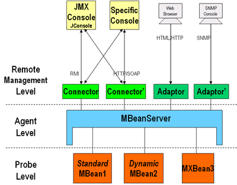
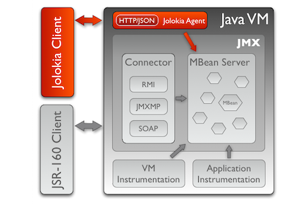
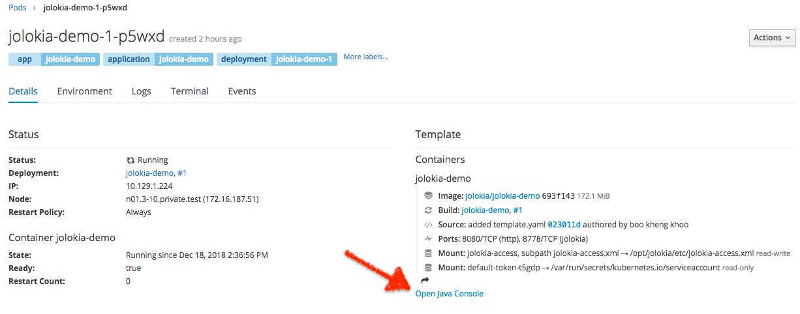

# Table of Contents

- [Java Application Monitoring with JMX and Jolokia](#java-application-monitoring-with-jmx-and-jolokia)
	- [Java Management Extensions (JMX)](#java-management-extensions-jmx)
		- [MBeans](#mbeans)
		- [Monitoring and Management Using JMX](#monitoring-and-management-using-jmx)
		- [Application hosted on OpenShift](#application-hosted-on-openshift)
		- [Building Java Application image with Jolokia for OpenShift](#building-java-application-image-with-jolokia-for-openshift)
	- [Jolokia](#jolokia)
		- [Jolokia Agent](#jolokia-agent)
		- [Security Policy](#security-policy)
		- [Jolokia JVM Agent Configuration](#jolokia-jvm-agent-configuration)
		- [Running Java Application with Jolokia JVM Agent](#running-java-application-with-jolokia-jvm-agent)
		- [Sample Jolokia Requests](#sample-jolokia-requests)
- [OpenShift Integration](#openshift-integration)
- [Simple Java MBean Example](#simple-java-mbean-example)
	- [Build and Deploy Locally](#build-and-deploy-locally)
	- [Build and Deploy On OpenShift](#build-and-deploy-on-openshift)
	- [Build and Deploy On OpenShift without Template](#build-and-deploy-on-openshift-without-template)
- [References](#references)

# Java Application Monitoring with JMX and Jolokia

## Java Management Extensions (JMX)
JMX is a standard component of the Java Standard Edition, providing a simple API for management and monitor of application resources at runtime.



JMX uses a three-level architecture:
* Probe/Instrumentation - contains the probes (called MBeans) instrumenting the resources. Once a resource has been instrumented by MBeans, it can be managed through a JMX agent.
* JMX Agent - the standard management agent that directly controls resources and makes them available for remote management applications. The core of the JMX Agent is the MBean server – where MBeans are registered.
* Remote Management - enables remote applications (such as JConsole) to access the MBeanServer through connectors and adaptors. Connectors serve to connect an agent with a remote JMX-enabled management application, while an adaptor adapts the API to another protocol (such as SNMP).

### MBeans

An MBean is a managed Java object that represents a manageable resource. An MBean can represent a device, an application, s service or any resource that needs to be managed. MBeans expose a management interface that consists of the following:
* A set of readable or writable attributes, or both.
* A set of invokable operations.

MBeans can also emit notifications when certain predefined events occur.

### Monitoring and Management Using JMX

Any Java application that is started on the Java SE 6 (and above) platform will support the JMX Attach API, and so will automatically be made available for local monitoring and management. This is usually enough for development but not for production.

JSR 160 connectors provide standard API to allow the remote management of the application using any management console that supports that standard. The standard allows use of different protocols for remote management, the most common is RMI (Remote Method Invocation).

To enable monitoring and management from remote systems with RMI, start the Java application with the JVM option:
```
com.sun.management.jmxremote.port=<portNum>
```

where `<portNum>` is the port number through which to enable JMX/RMI connections.

### Application hosted on OpenShift
For Java application running on OpenShift platform:
1. Within in container, start the application with the JVM options:
```
java -Dcom.sun.management.jmxremote \
     -Dcom.sun.management.jmxremote.authenticate=false \
     -Dcom.sun.management.jmxremote.ssl=false \
     -Dcom.sun.management.jmxremote.local.only=false \
     -Dcom.sun.management.jmxremote.port=1099 \
     -Dcom.sun.management.jmxremote.rmi.port=1099 \
     -Djava.rmi.server.hostname=127.0.0.1 \
     -jar target/hello-1.0.jar
```

**Note**:
* The same port should be used for `jmxremote.port` and `jmxremote.rmi.port`, this is needed to forward one port only.
* `127.0.0.1` should be passed as `rmi.server.hostname`; this is needed for JMX connection to work via port-forwarding.
* `authenticate` and `SSL` is set to `false`; this is very insecure and should not be used in production. Refer to JMX documentation on how to setup authentication and SSL.

1. On OpenShift command line interface, forward the JMX port (1099) to local host with `oc` command:
```
oc port-forward <java-app-pod> 1099:1099
```

1. Open JConsole connection to local port 1099:
```
jconsole 127.0.0.1:1099
```

## Jolokia

Jolokia is a JMX-HTTP bridge, providing a RESTful way for accessing JMX MBeans remotely. MBeans can be provided by the JVM itself, by an application server or the Java application itself. Jolokia is an agent based approach, living side by side with JSR 160, but uses the much more open HTTP/S for its transport where the data payload is serialized in JSON. In addition to basic JMX operations, it enhances JMX remoting with unique features like bulk requests and fine grained security policies.



Jolokia provides access to the JMX MBeans using the following operations:
* Read: Reading MBean attribute values
* Write: Setting MBean attribute values
* Exec: Execute exposed MBean operations
* Search: Search for MBeans in a Domain
* List: Lists accessible MBeans along with their supported attributes and operations
* Version: Returns the version of the Jolokia agent along with the protocol version

Jolokia requests can be sent as a HTTP GET, where the parameters are encoded in the URL; or as an HTTP POST, where the request is added to a JSON payload in the HTTP request's body. The response returned is always in a JSON format.

### Jolokia Agent

Jolokia is an agent based approach to JMX, which requires an extra piece of software to be deployed with the Java application. This software either needs to be deployed on the target server which should be accessed via JMX, or it can be installed on a dedicated proxy server. For both operational modes, there are four different kind of agents:
* Webarchive (War) agent
* OSGi agent
* Mule agent
* JVM agent

### Security Policy

The default configuration for Jolokia provides full access to the JMX MBeans attributes and operations, so it is important for system administrators to lock down access to these in production environments.

Jolokia can be configured with an XML security policy file which allows for fine grained security of the JMX MBeans. Access restrictions can be configured for MBean, attributes, operations, source IP addresses and type of Jolokia operation.

The following shows an example security policy file, `jolokia-access.xml`, that set the policy:
* Grant access only to HTTP clients from localhost and hosts on 192.168.1.0/24 subnet
* Globally only allow read, list, version and search Jolokia commands; basically read only access
* For `com.example.mbeans:type=Hello` MBean:
  * allow all operations
  * allow only write access to `Property1` attribute
* For `com.sun.management:type=HotSpotDiagnostic` MBean:
  * allow only `dumpHeap` operation
* For all MBeans from `java.lang` domain, disallow access to all attributes and operations

```
<?xml version="1.0" encoding="utf-8"?>
<restrict>
  <remote>
    <host>127.0.0.1/24</host>
    <host>192.168.1.0/24</host>
  </remote>

  <!--
  <http>
    <method>get</method>
    <method>post</method>
  </http>
  -->

  <commands>
    <command>read</command>
    <command>list</command>
    <command>version</command>
    <command>search</command>
    <!--
    <command>write</command>
    <command>exec</command>
    -->
  </commands>

  <allow>
    <mbean>
      <name>com.example.mbeans:type=Hello</name>
      <operation>*</operation>
      <attribute mode="write">Property1</attribute>
    </mbean>
    <mbean>
      <name>com.sun.management:type=HotSpotDiagnostic</name>
      <operation>dumpHeap</operation>
    </mbean>
  </allow>

  <deny>
    <mbean>
      <name>java.lang:type=*</name>
      <operation>*</operation>
      <attribute>*</attribute>
    </mbean>
  </deny>
</restrict>
```

**Note**: Refer to [Jolokia documentation](https://jolokia.org/reference/html/security.html) for more details.

### Jolokia JVM Agent Configuration

The following shows a sample Jolokia JVM agent configuration file, `jolokia.properties`; the configuration file referred the security policy defined in the previous section:
```
host=*
port=8778
discoveryEnabled=false
policyLocation=file:///opt/example/jolokia-access.xml
protocol=https
useSslClientAuthentication=true
extraClientCheck=true
serverCert=/opt/example/jolokia.crt
serverKey=/opt/example/jolokia.key
caCert=/opt/example/ca.crt
clientPrincipal=cn=jolokia-client
```

**Note**:
* The configuration above enabled TLS transport for Jolokia, with mutual authentication.
* Refer to [Jolokia documentation](https://jolokia.org/reference/html/agents.html#agents-jvm) for more details of configuration options.

### Running Java Application with Jolokia JVM Agent

The Jolokia JVM agent uses the JVM Agent interface for linking into any JVM. Under the hood it uses an HTTP-Server, which is available on every Oracle/Sun JVM from version 1.6 upwards. The agent can be started by any Java program by providing the `-javaagent` startup options to the JVM:
```
java -javaagent:/opt/example/jolokia.jar=config=/opt/example/jolokia.properties \
     -jar target/hello-1.0.jar
```

### Building Java Application image with Jolokia for OpenShift

OpenShift xPaaS images have built-in Jolokia support (see [OpenShift Integration](#openshift-integration)). However, if the base image for the Java application is not one of the OpenShift xPaaS images, in addition to the normal build steps, include the following the allow the custom image to integrate with OpenShift for Jolokia usage:
* Copy the Jolokia agent binary to the image.
* Create a Jolokia agent (using JVM agent as an example here) configuration file, `jolokia.properties`:

```
host=*
port=8778
discoveryEnabled=false
policyLocation=file:///opt/example/jolokia-access.xml
protocol=https
useSslClientAuthentication=true
extraClientCheck=true
caCert=/var/run/secrets/kubernetes.io/serviceaccount/ca.crt
clientPrincipal=cn=system:master-proxy
```

* Copy the Jolokia configuration file, `jolokia.properties`, to the image.
  * The configuration file can be provided to the container with OpenShift ConfigMap as well, but since this file is static, it can be baked into the image.
* Optionally, copy the Jolokia security policy file, `jolokia-access.xml`, to `/opt/example` (or other location) in the image.
  * The security policy file can be provided to the container with OpenShift ConfigMap as well.
* Start the Java application with the `-javaagent` startup option, referencing the Jolokia configuration file.

**Note**:
The configure file above:
* remove `serverCert` and `serverKey` options,
* set the the `caCert` option to OpenShift CA, and,
* set `clientPrincipal` option to `cn=system:master-proxy`; OpenShift uses the client certificate `/etc/origin/master/master.proxy-client.crt` to authenticate with Jolokia

### Sample Jolokia Requests
```
# read an attribute with HTTP GET
curl --cacert ./ca.crt --cert ./jolokia-client.crt --key ./jolokia-client.key \
  https://127.0.0.1:8778/jolokia/read/com.example.mbeans:type=Hello/Property1

# write an attribute with HTTP GET
curl --cacert ./ca.crt --cert ./jolokia-client.crt --key ./jolokia-client.key \
  https://127.0.0.1:8778/jolokia/write/com.example.mbeans:type=Hello/Property1/1234

# exec an operation with HTTP GET, the operation does not require any parameter
curl --cacert ./ca.crt --cert ./jolokia-client.crt --key ./jolokia-client.key \
  https://127.0.0.1:8778/jolokia/exec/com.example.mbeans:type=Hello/sayHello

# exec an operation with HTTP GET, passing the parameters for the operation as part of the URL
curl --cacert ./ca.crt --cert ./jolokia-client.crt --key ./jolokia-client.key \
  https://127.0.0.1:8778/jolokia/exec/com.example.mbeans:type=Hello/add/3/3

# exec an operation with HTTP POST, passing the parameters as JSON payload
curl --cacert ./ca.crt --cert ./jolokia-client.crt --key ./jolokia-client.key \
  https://127.0.0.1:8778/jolokia/ -XPOST \
  --data '{ "type":"exec", "mbean":"com.example.mbeans:type=Hello", "operation":"add", "arguments":[3, 3] }'

# dumps the heap to the outputFile file in the same format as the hprof heap dump
curl --cacert ./ca.crt --cert ./jolokia-client.crt --key ./jolokia-client.key \
  https://127.0.0.1:8778/jolokia/ -XPOST \
  --data '{ "type":"exec", "mbean":"com.sun.management:type=HotSpotDiagnostic", "operation":"dumpHeap", "arguments":["/tmp/heap-dump.hprof", false] }'
```

# OpenShift Integration

OpenShift xPaaS images expose JMX operations through the JMX-HTTP bridge provided by Jolokia, where simple REST based methods and JSON based payloads provide a simplified and lightweight approach to remote application monitoring and management. The Jolokia package is embedded within each xPaaS Docker image as a JVM agent for instrumenting the running application server. Clients can communicate with the agent using port 8778, which is exposed by default from the docker image.

OpenShift provides the ability to proxy HTTP/S requests through the API server to a pod inside the cluster. A HTTP request to a pod as follows:
```
curl http://<pod-ip>:<pod-port>/<url-path>
```

can be proxied by OpenShift API server in the following way:
```
curl -k -H "Authorization:Bearer $(oc whoami -t)" \
  https://<master-hostname>:<master-port>/api/v1/namespaces/<project>/pods/<protocol>:<pod-name>:<pod-port>/proxy/<url-path>
```

**Note**:
* The OpenShift API server authenticate the request before proxy it to the pod, the proxy request must include `Authorization` header in the request.
* The user making the proxy request must have `proxy` privilege to the pod in the `project`.
* The proxy via OpenShift API server method allows access to pod without having to expose the pod's port via service/route.

Similarly, a Jolokia request (to create JVM heap dump) for instrumenting the Java application running in a pod as follows:
```
curl -k --cert ./master.proxy-client.crt --key ./master.proxy-client.key -XPOST \
  https://<pod-ip>:<jolokia-port>/jolokia/ \
  --data '{ "type":"exec", "mbean":"com.sun.management:type=HotSpotDiagnostic", "operation":"dumpHeap", "arguments":["/tmp/heap-dump.hprof", false] }'
```

can be proxied by OpenShift API server in the following way:
```
curl -k -H "Authorization:Bearer $(oc whoami -t)" -XPOST \
  https://<master-hostname>:<master-port>/api/v1/namespaces/<project>/pods/https:<pod-nane>:<jolokia-port>/proxy/jolokia/ \
  --data '{ "type":"exec", "mbean":"com.sun.management:type=HotSpotDiagnostic", "operation":"dumpHeap", "arguments":["/tmp/heap-dump.hprof", false] }'
```

Alternatively, if the pod's container (running OpenShift xPaaS image) has a port named `jolokia`,  a link to `Java Console` will be displayed in the pod details page of the OpenShift Web console:


The `Java Console` link opens a [hawt.io](hawt.io) based JVM console for viewing and managing any relevant integration components.

The following shows a partial `DeploymentConfig` of how to configure and expose Jolokia with security policy using OpenShift xPaaS images.
```
apiVersion: v1
kind: DeploymentConfig
metadata:
  ...
  name: jolokia-demo
  ...
spec:
  ...
  replicas: 1
  template:
    metadata:
      ...
      name: jolokia-demo
    spec:
      containers:
      - env:
        - name: AB_JOLOKIA_OPTS
          value: policyLocation=file:///opt/jolokia/etc/jolokia-access.xml
        - name: AB_JOLOKIA_PASSWORD_RANDOM
          value: "false"
        ...
        name: jolokia-demo
        ports:
        - containerPort: 8778
          name: jolokia
          protocol: TCP
        ...
        volumeMounts:
        - mountPath: /opt/jolokia/etc/jolokia-access.xml
          name: jolokia-access
          subPath: jolokia-access.xml
      ...
      volumes:
      - configMap:
          defaultMode: 420
          name: jolokia-access
        name: jolokia-access
  ...
```


# Simple Java MBean Example

This repository contains a simple Java MBean source code. The Hello MBean implements the following management attributes and operations:
* Attribute:
  * **Name**: read only string attribute
  * **Property1**: read write integer attribute
  * **Property2**: read write integer attribute
* Operations:
  * **add**: add two integers; return the resultant integer
  * **sayHello**: return 'hello, world' string
  * **dumpHeap**: return base64 encoded heap dump (gzip)

**Note**:
* The **dumpHeap** operation in the sample code invoke the **dumpHeap** operation from the JVM **com.sun.management:type=HotSpotDiagnostic** MBean to write the heap dump to disk, gzip the dump file, base64 encode the gzip file, and return the gzip heap dump as base64 encoded string in the JSON response.
* The base64 encoding could cause the JMV to run out of memory, **use with case**.

## Build and Deploy Locally
```
git clone https://github.com/bkkhoo/jolokia-demo
cd jolokia-demo
mvn clean package
java -javaagent:/opt/example/jolokia.jar=config=/opt/example/jolokia.properties -jar target/hello-1.0.jar
```

## Build and Deploy On OpenShift

* Clone the Git Repo
```
git clone https://github.com/bkkhoo/jolokia-demo
cd jolokia-demo
```

* Create A Project
```
oc new-project jolokia-demo
```

* Create the Application Template
```
oc apply -f template.yaml
```

* Build and Deploy the Jolokia Demo App
```
oc new-app --template=jolokia-demo --param=JOLOKIA_PORT=8778
```

* Clean up
The following commands clean up the OpenShift resources created in the previous steps.
```
oc delete all --selector='app=jolokia-demo'
oc delete configmap/jolokia-access template/jolokia-demo
for i in $(oc get image | grep jolokia-demo | awk '{print $1}'); do oc delete image $i; done
oc delete project jolokia-demo
```

## Build and Deploy On OpenShift without template

* Clone the Git Repo
```
git clone https://github.com/bkkhoo/jolokia-demo
cd jolokia-demo
```

* Create A Project
```
oc new-project jolokia-demo
```

* Build the Jolokia Demo App
```
oc new-build redhat-openjdk18-openshift:1.4~https://github.com/bkkhoo/jolokia-demo --labels='app=jolokia-demo'
```

* Create ConfigMap of Jolokia security policy (jolokia-access.xml)
```
oc create configmap jolokia-access --from-file=./jolokia-access.xml
oc label configmap/jolokia-access app=jolokia-demo
```

* Deploy the Jolokia Demo App
```
oc new-app --allow-missing-imagestream-tags --image-stream=jolokia-demo AB_JOLOKIA_PASSWORD_RANDOM="false" AB_JOLOKIA_OPTS="policyLocation=file:///opt/jolokia/etc/jolokia-access.xml"
```

* Update the DeploymentConfig to Name the Jolokia Port and Mount the ConfigMap with Security Policy
```
oc patch dc/jolokia-demo -p '
{
  "spec": {
    "template": {
      "spec": {
        "$setElementOrder/containers": [
          {
            "name": "jolokia-demo"
          }
        ],
        "containers": [
          {
            "name": "jolokia-demo",
            "ports": [
              {
                "containerPort": 8778,
                "name": "jolokia"
              }
            ],
            "volumeMounts": [
              {
                "mountPath": "/opt/jolokia/etc/jolokia-access.xml",
                "name": "jolokia-access",
                "subPath": "jolokia-access.xml"
              }
            ]
          }
        ],
        "volumes": [
          {
            "configMap": {
              "name": "jolokia-access"
            },
            "name": "jolokia-access"
          }
        ]
      }
    }
  }
}'
```

# References
* [JSR 160: JMX Remote API](https://www.jcp.org/en/jsr/detail?id=160)
* [Monitoring and Management Using JMX Technology](https://docs.oracle.com/javase/6/docs/technotes/guides/management/toc.html)
* [Monitoring and Management Interface for the Java Platform](https://docs.oracle.com/javase/8/docs/jre/api/management/extension/overview-summary.html)
* [JMX Examples](https://docs.oracle.com/javase/8/docs/technotes/guides/jmx/examples.html)
* [JMXTerm - command line alternative of JConsole](https://github.com/jiaqi/jmxterm)
* [Jolokia](https://jolokia.org/index.html)
* [OpenShift JVM Console](https://docs.openshift.com/container-platform/3.10/architecture/infrastructure_components/web_console.html)
* [Red Hat Java S2I for OpenShift](https://access.redhat.com/documentation/en-us/red_hat_jboss_middleware_for_openshift/3/html-single/red_hat_java_s2i_for_openshift/)
* [Troubleshooting Java applications on OpenShift](https://developers.redhat.com/blog/2017/08/16/troubleshooting-java-applications-on-openshift/)
* [Maven in 5 Minutes](https://maven.apache.org/guides/getting-started/maven-in-five-minutes.html)
